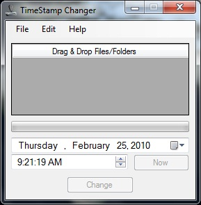

# TimeStamp Changer

This is a GUI to easily change the timestamp on any file using native functions. I was prompted to build this to see if it was possible using managed code rather than the more common method of using Windows APIs, which could break in the future.

Releases: [https://github.com/StevenJDH/TimeStamp-Changer/releases](https://github.com/StevenJDH/TimeStamp-Changer/releases)

Changelog: [https://github.com/StevenJDH/TimeStamp-Changer/wiki/Changelog](https://github.com/StevenJDH/TimeStamp-Changer/wiki/Changelog)

## Features
* Drag and Drop files/folders
* Multithreaded
* Batch processing support
* Visually or manually set the new date and or time.

## Do you have any questions?
Many commonly asked questions are answered in the FAQ:
[https://github.com/StevenJDH/TimeStamp-Changer/wiki/FAQ](https://github.com/StevenJDH/TimeStamp-Changer/wiki/FAQ)

## Want to show your support?

|Method       | Address                                                                                                    |
|------------:|:-----------------------------------------------------------------------------------------------------------|
|PayPal:      | [https://www.paypal.me/stevenjdh](https://www.paypal.me/stevenjdh "Steven's Paypal Page")                  |
|Bitcoin:     | 3GyeQvN6imXEHVcdwrZwKHLZNGdnXeDfw2                                                                         |
|Litecoin:    | MAJtR4ccdyUQtiiBpg9PwF2AZ6Xbk5ioLm                                                                         |
|Ethereum:    | 0xa62b53c1d49f9C481e20E5675fbffDab2Fcda82E                                                                 |
|Dash:        | Xw5bDL93fFNHe9FAGHV4hjoGfDpfwsqAAj                                                                         |
|Zcash:       | t1a2Kr3jFv8WksgPBcMZFwiYM8Hn5QCMAs5                                                                        |
|PIVX:        | DQq2qeny1TveZDcZFWwQVGdKchFGtzeieU                                                                         |
|Ripple:      | rLHzPsX6oXkzU2qL12kHCH8G8cnZv1rBJh Destination Tag: 2357564055                                        |
|Monero:      | 4GdoN7NCTi8a5gZug7PrwZNKjvHFmKeV11L6pNJPgj5QNEHsN6eeX3D &#8618;aAQFwZ1ufD4LYCZKArktt113W7QjWvQ7CWDXrwM8yCGgEdhV3Wt|

// Steven Jenkins De Haro ("StevenJDH" on GitHub)
